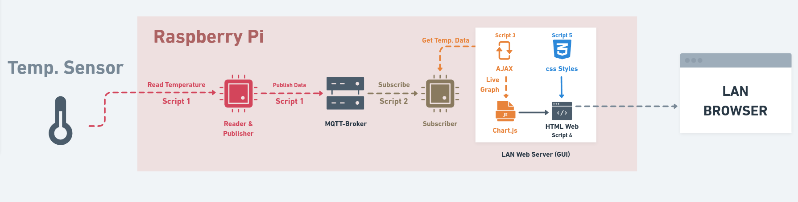

# Bericht zum Temperaturmesssystem

## 1. Einleitung

Die Erfassung und Visualisierung von Sensordaten ist eine zentrale Aufgabe in modernen Überwachungssystemen. Ziel dieses Projekts war die Entwicklung eines Temperaturmesssystems, das auf einem Raspberry Pi basiert und die erfassten Messwerte über das MQTT-Protokoll an eine Webanwendung weiterleitet. Die Anwendung stellt diese Daten in Echtzeit grafisch dar und ermöglicht eine benutzerfreundliche Interpretation.

Zur Umsetzung wurde ein DHT11-Sensor mit dem Raspberry Pi verbunden, der die Temperaturwerte ausliest und diese periodisch an einen MQTT-Broker sendet. Ein Python-gestützter Webserver empfängt diese Daten, verarbeitet sie und stellt sie über eine browserbasierte Schnittstelle bereit. 

Die Kombination aus MQTT, Webserver-Technologien und Echtzeitvisualisierung mit Chart.js bietet eine flexible Grundlage für eine erweiterbare Architektur. Die modulare Struktur erlaubt es, das System durch weitere Sensoren oder zusätzliche Analysefunktionen zu ergänzen. Die nachfolgenden Abschnitte erläutern die technische Umsetzung und die Herausforderungen dieses Projekts.

## 2.1 **Datenquelle: Sensor und MQTT-Publisher**

Die Temperaturdaten werden mit einem **DHT11-Sensor** erfasst, der mit dem Raspberry Pi verbunden ist. Dieser Sensor misst sowohl die Temperatur als auch die Luftfeuchtigkeit und überträgt die erfassten Werte über ein digitales Signal an den Raspberry Pi.

Zur Datenübertragung wird das **MQTT-Protokoll** verwendet, ein lightweight Kommunikationsprotokoll, das nach dem **Publisher-Subscriber-Prinzip** arbeitet. Der Raspberry Pi fungiert als **Publisher** und sendet die Temperaturwerte in regelmäßigen Intervallen an ein bestimmtes MQTT-Topic. Ein MQTT-Broker, der auf einer festen IP-Adresse läuft, empfängt die Daten und stellt sie für Subscribing-Clients bereit.

Die Implementierung erfolgt mit der **Paho MQTT-Bibliothek**, die eine einfache Integration der MQTT-Funktionalität in Python ermöglicht. Der MQTT-Publisher verbindet sich mit dem Broker, sendet die ausgelesenen Werte und behandelt mögliche Verbindungsprobleme durch einen automatischen Wiederverbindungsmechanismus.

Im weiteren Verlauf werden die empfangenen Daten durch den Subscriber verarbeitet und zur Visualisierung aufbereitet.

## 2.2 **Datenverarbeitung: MQTT-Subscriber und Webserver**

Die vom **MQTT-Publisher** gesendeten Temperaturwerte werden durch einen **MQTT-Subscriber** empfangen, der die Daten in einer **Liste** speichert, um sie für eine spätere Verarbeitung bereitzuhalten. Der Subscriber agiert als permanenter Listener, der auf neue Messwerte im zugehörigen MQTT-Topic reagiert und diese in einem Pufferspeicher ablegt.

Um die empfangenen Werte für externe Anwendungen verfügbar zu machen, wird ein **Webserver** auf Basis des **Bottle-Frameworks** eingesetzt. Dieser Webserver stellt eine **REST-Schnittstelle** bereit, über die die gespeicherten Temperaturdaten als JSON-Daten abgerufen werden können. Dadurch können sowohl Webanwendungen als auch andere Systeme die Sensordaten in Echtzeit nutzen.

Der Webserver läuft parallel zum Subscriber und wird bei Start der Anwendung automatisch gestartet. Dadurch ist sichergestellt, dass sowohl die Datenverarbeitung als auch die Bereitstellung der Messwerte kontinuierlich und ohne manuelles Eingreifen erfolgen kann.

## 2.3 **Datenvisualisierung: Web-Oberfläche**

Die erfassten und über MQTT übertragenen Temperaturdaten werden in einer browserbasierten **Web-Oberfläche** visualisiert. Diese stellt die Werte in Echtzeit dar und ermöglicht eine einfache Analyse der Temperaturverläufe.

Zur Darstellung kommt **Chart.js** zum Einsatz, eine JavaScript-Bibliothek, die eine dynamische und interaktive Anzeige der Sensordaten ermöglicht. Die Web-Oberfläche ruft regelmäßig die aktuellen Messwerte von der **REST-Schnittstelle** des Webservers ab und aktualisiert die Anzeige in definierten Zeitintervallen.

Die Implementierung erfolgt mittels **HTML, JavaScript und CSS**. Ein **Canvas-Element** dient als Zeichenfläche für das Diagramm, während ein Skript die Daten aus dem Webserver ausliest und an Chart.js übergibt. Dadurch werden die Temperaturwerte laufend aktualisiert, sodass eine kontinuierliche Überwachung der Sensordaten gewährleistet ist.

Durch diese Architektur kann das System leicht erweitert werden, beispielsweise durch die Integration weiterer Sensordaten oder die Speicherung historischer Messwerte zur langfristigen Analyse.

## 3. **Systemaufbau und Funktionsweise**

Das Temperaturmesssystem besteht aus mehreren miteinander verbundenen Komponenten, die eine reibungslose Erfassung, Übertragung und Visualisierung der Sensordaten gewährleisten. Die Datenübertragung erfolgt über das **MQTT-Protokoll**, das eine effiziente Kommunikation zwischen Sensor, Webserver und Web-Oberfläche ermöglicht.

Die Temperaturmessung beginnt mit dem **DHT11-Sensor**, der in regelmäßigen Abständen die Umgebungstemperatur erfasst. Diese Daten werden anschließend von einem **MQTT-Publisher** verarbeitet, der auf dem Raspberry Pi läuft. Der Publisher sendet die Messwerte an ein spezifisches **MQTT-Topic**, von dem sie durch einen **MQTT-Subscriber** empfangen werden. Der Subscriber speichert die Werte in einer Pufferliste, um eine kontinuierliche Verfügbarkeit der aktuellen Messdaten zu gewährleisten.

Zur Bereitstellung der Sensordaten wird ein **Webserver** auf Basis des **Bottle-Frameworks** eingesetzt. Dieser verarbeitet die eingehenden Temperaturwerte und stellt sie über eine **REST-Schnittstelle** im JSON-Format für externe Anwendungen bereit. Die Web-Oberfläche ruft in festgelegten Intervallen die aktuellen Daten von diesem Server ab und visualisiert sie mit **Chart.js**, sodass eine Echtzeitüberwachung möglich ist.

Die einzelnen Systemkomponenten arbeiten nahtlos zusammen. Der **Raspberry Pi** übernimmt die zentrale Steuerung der Mess- und Übertragungsprozesse, während der **MQTT-Broker** die Kommunikation zwischen Publisher und Subscriber verwaltet. Der **Webserver** dient als Schnittstelle zwischen der Datenverarbeitung und der Darstellung, wodurch die erfassten Sensordaten jederzeit über die Web-Oberfläche zugänglich sind. Diese modulare Architektur bietet eine hohe Flexibilität und erlaubt zukünftige Erweiterungen, beispielsweise durch die Integration weiterer Sensoren oder die Speicherung historischer Messwerte zur langfristigen Analyse.

## 4. **Ergebnisse und Herausforderungen**

Das entwickelte System zur Temperaturüberwachung hat sich als funktional und zuverlässig erwiesen. Die erfassten Temperaturwerte werden kontinuierlich über MQTT übertragen und können in Echtzeit über die Web-Oberfläche visualisiert werden. Die Implementierung der Datenverarbeitung und -darstellung verlief erfolgreich, sodass Nutzer jederzeit auf die aktuellen Sensordaten zugreifen können. Die Kombination aus MQTT, einem Bottle-Webserver und Chart.js ermöglicht eine effiziente und dynamische Anzeige der Temperaturverläufe.

Während der Umsetzung traten jedoch einige Herausforderungen auf, die gelöst werden mussten. Eine der größten Schwierigkeiten bestand darin, dass das System auf verschiedenen Technologien und Programmiersprachen basiert. Eine einheitliche Sprache für alle Komponenten wäre wünschenswert gewesen, um die Komplexität zu reduzieren. Zusätzlich war es unschön, dass unterschiedlichste Datentypen permanent zwischen den Komponenten hin und her geschoben und umgewandelt werden mussten, was die Entwicklung erschwerte.

Ein weiteres Problem betraf die ursprünglichen Pläne zur Einrichtung des Systems auf dem Raspberry Pi. Entgegen der Planung wurde keine Installation auf dem Raspberry Pi vorgenommen, und der geplante GitHub-Sync zur Versionskontrolle wurde nicht realisiert. Dies führte zu manuellen Anpassungen und einer weniger automatisierten Arbeitsweise. Zudem kam es zu Port-Konflikten, da bereits belegte Ports manuell angepasst werden mussten, um die Dienste erfolgreich ausführen zu können.

Trotz dieser Herausforderungen konnte ein stabiles und erweiterbares System realisiert werden. Durch die modulare Struktur ist es möglich, zukünftige Verbesserungen vorzunehmen, etwa durch den Einsatz eines präziseren Sensors oder die Speicherung historischer Messwerte für Langzeitanalysen.

## 5. **Fazit und Ausblick**

Das entwickelte Temperaturmesssystem hat erfolgreich gezeigt, dass die Kombination aus einem Raspberry Pi, MQTT und einer Web-Oberfläche eine zuverlässige und flexible Möglichkeit zur Sensordatenerfassung und -visualisierung bietet. Die Architektur des Systems ermöglicht eine kontinuierliche Überwachung der Temperaturwerte in Echtzeit, wobei die erfassten Daten effizient verarbeitet und dargestellt werden. Die Nutzung des MQTT-Protokolls gewährleistet eine schnelle und ressourcenschonende Übertragung der Messwerte, während der Bottle-Webserver eine benutzerfreundliche Bereitstellung der Daten für die Web-Oberfläche sicherstellt.

Für eine Weiterentwicklung des Projekts bieten sich mehrere Ansätze an. Eine mögliche Verbesserung wäre die Speicherung der Temperaturdaten in einer **Datenbank**, um langfristige Analysen und historische Vergleiche zu ermöglichen. Zudem könnte die Integration von **Docker** dazu beitragen, das System noch portabler und einfacher bereitzustellen. Eine weitere Optimierung wäre der Einsatz eines präziseren Temperatursensors, um noch genauere Messwerte zu erhalten. Schließlich könnte eine Erweiterung der Web-Oberfläche zusätzliche Analysefunktionen oder die Unterstützung mehrerer Sensoren ermöglichen.

Zusammenfassend zeigt das Projekt, dass eine kompakte und effiziente Lösung zur Sensordatenerfassung und -visualisierung erfolgreich umgesetzt werden kann. Die entwickelten Komponenten bieten eine solide Grundlage für weiterführende Entwicklungen und potenzielle Anwendungsfälle in anderen Bereichen der Umweltüberwachung oder industriellen Sensorik.